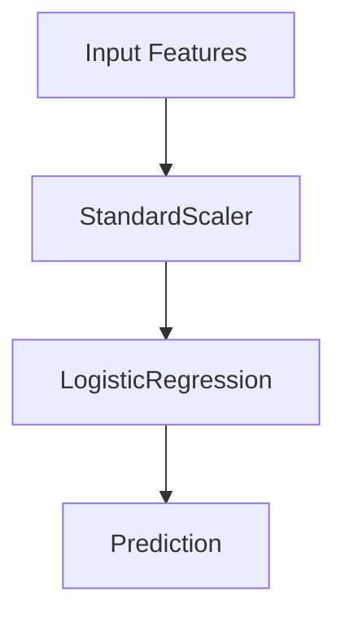

# Module 1 — ML Pipeline & Data Leakage Experiment

## 1. Objective

This module focuses on building a reproducible machine learning pipeline
and demonstrating the importance of preventing data leakage during model
development.

The workflow includes:

- Loading Breast Cancer dataset.
- Splitting data using stratified train-test split.
- Building Scikit-learn Pipeline:
  - StandardScaler
  - LogisticRegression
- Evaluating model performance.
- Performing 5-fold Cross Validation.
- Comparing correct workflow with a leakage workflow.

---

## 2. Dataset Preparation

**Dataset:**

- **Source:** `sklearn.datasets.load_breast_cancer`
- **Task:** Binary classification
- **Number of samples:** 569
- **Number of features:** 30

**Train/Test split:**

| Parameter | Value |
|---|---:|
| Test size | 20% |
| Random state | 42 |
| Stratify | Enabled |

**Result:**

- **Train:** (455, 30)
- **Test:** (114, 30)

---

## 3. Machine Learning Pipeline

The implemented pipeline:



Implementation:

```python
Pipeline(
    steps=[
        ('scaler', StandardScaler()),
        ('classifier', LogisticRegression(random_state=42))
    ]
)
```